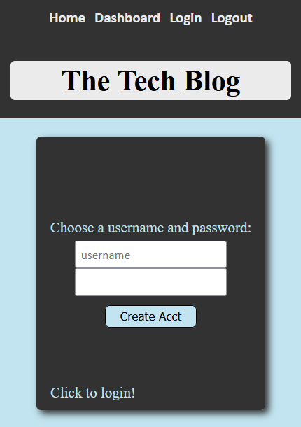
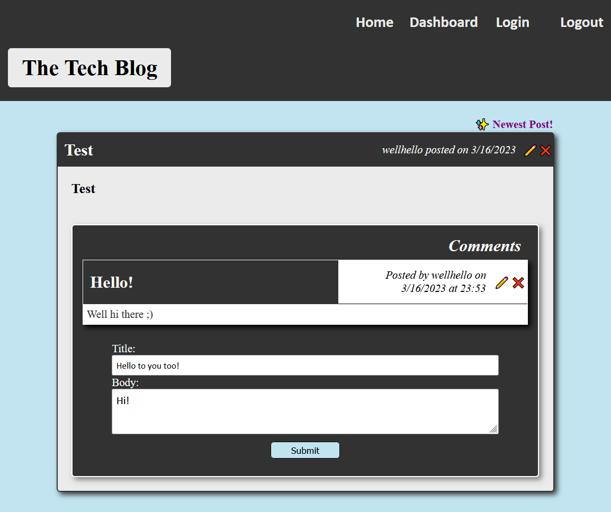

# blog-app 

## Description

This challenge was to create a full stack application allowing for account creation, user login and authentication, blogging, and commenting.  There was no starter code and everything was built from the ground up and deployed to Heroku.  There were specific challenges when rendering with handlebars, as well as ensuring users can only edit and delete their notes.

## Table of Contents

- [Installation](#installation)
- [Usage](#usage)
- [License](#license)
- [Credits](#credits)
- [Questions](#questions)

## Installation

No install required - visit the live application at https://blogzzz.herokuapp.com.

## Usage

Visit the above URL, then click "Get Started" to see notes.  Users can view old notes by clicking them, or add a new note by clicking the '+' sign in the upper right hand corner, followed by the save icon after entering a note title and text.  Users can also delete notes by clicking the red trashcan associated with the note.

### Screenshot of landing page (/index)

## License

MIT License - Please refer to the LICENSE in the repo.

## Credits

N/A

## Questions

You can view my Github @ https://www.github.com/maximusDecimalusMeridius  
OR  
Email me with questions @ [andygg_dev@yahoo.com](mailto:andygg_dev@yahoo.com?subject=Question%20About%20blog-app%20App)
    